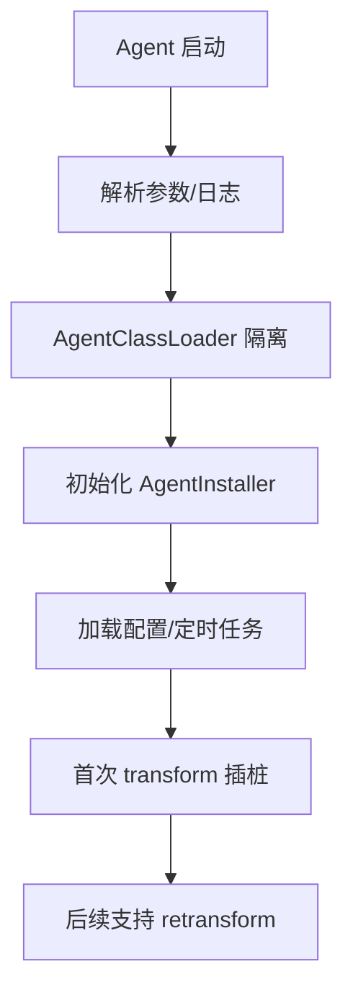
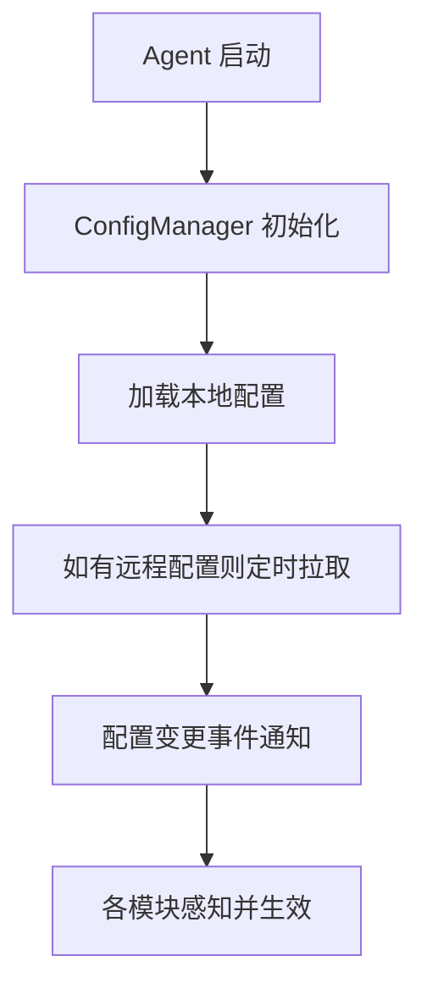
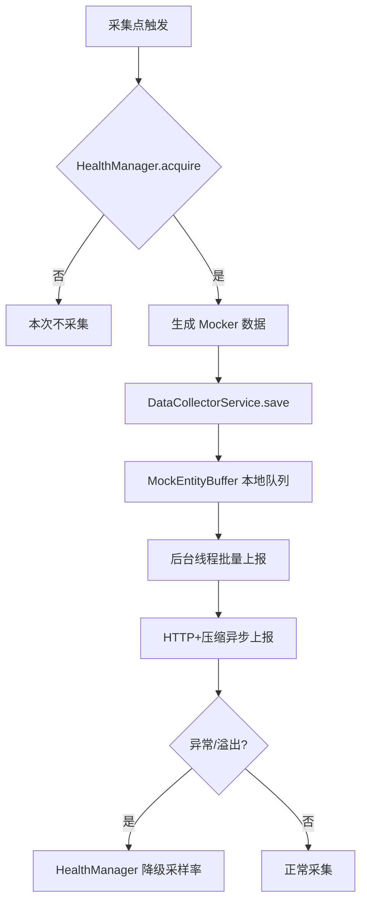
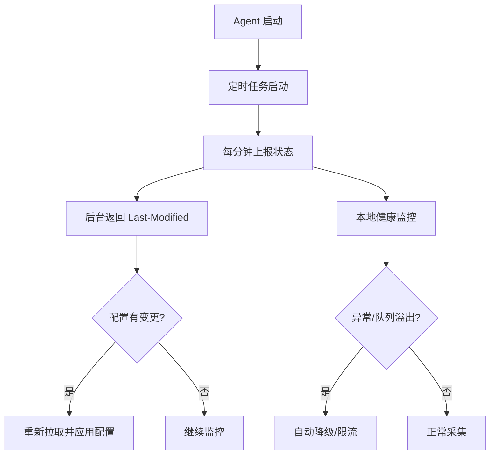

# arex-agent-java 源码学习笔记

> 本文档系统梳理了 arex-agent-java 的架构、核心链路与关键实现细节，所有讲解、注释、流程图均为中文，便于回顾和团队交流。

---

## 1. 项目整体结构与定位

- **项目定位**：arex-agent-java 是基于 Java Agent 的无侵入流量采集与回放测试框架，支持多种主流中间件和库。
- **多模块结构**：
  - `arex-agent`：agent 主体
  - `arex-agent-core`：核心功能
  - `arex-instrumentation`：各类中间件/库的插桩实现（如 Redis、Dubbo、HttpClient 等）
  - `arex-integration-tests`：集成测试
  - 其他：bootstrap、third-party、foundation、api 等

---

## 2. agent 启动流程

- **入口类**：`ArexAgent`，支持 `premain`/`agentmain` 两种启动方式。
- **初始化流程**：
  1. 解析 agent 参数
  2. 初始化日志
  3. 创建专用 `AgentClassLoader`（类隔离，防止冲突）
  4. 初始化 `AgentInstaller`，注册所有插桩
  5. 加载配置，启动定时任务
  6. 首次 transform 插桩，后续支持 retransform 动态增强

- **流程图**：



---

## 3. 插桩注册流程

- **核心类**：`InstrumentationInstaller`
- **主要方法**：
  - `transform/retransform`：注册/重新注册字节码增强
  - `install/installModule/installType/installMethod`：模块、类型、方法级别的插桩注册
- **Advice 加载机制**：通过 include(AgentClassLoader) 实现 Advice 逻辑与业务类的隔离与调用

---

## 4. 配置管理链路

### 4.1 配置加载与热更新

- **核心类**：`ConfigManager`
- **加载流程**：
  1. 启动时优先加载本地配置（如 arex.agent.conf、JVM 参数）
  2. 如配置了远程配置中心（如 AREX 后台、Apollo），则定时拉取并热更新
  3. 配置变更通过事件订阅机制通知各模块

- **关键配置项**（部分）：
  - `enableDebug`、`serviceName`、`storageServiceHost`、`recordRate`、`dynamicClassList`、`allowDayOfWeeks`、`disabledModules` 等

- **流程图**：



### 4.2 AREX 后台配置拉取

- 通过 HTTP 定时拉取 AREX 后台接口（非 Apollo），并支持 1 分钟内变更检测与热更新。

---

## 5. 采样频率控制与数据上报链路

### 5.1 采样频率控制

- **配置项**：`recordRate`（如 1=全采，10=1/10 采样）
- **健康自适应**：`HealthManager` 检测队列溢出/异常时自动降级采样率，优先于配置项
- **采样判断**：所有采集点统一调用 `HealthManager.acquire("operationName")` 判断是否采集

### 5.2 数据上报链路

- **本地缓冲**：采集数据先入 `MockEntityBuffer` 队列，防止阻塞业务线程
- **异步批量上报**：后台线程池批量取数据，异步 HTTP+压缩上报到 AREX 后台
- **异常降级**：上报失败/队列溢出时自动降级采样率，保障业务稳定

- **流程图**：



---

## 6. 状态上报与健康监控链路

- **定时上报**：每分钟通过 `ConfigService#reportStatus` 上报 agent 状态（采样率、健康码等）到 AREX 后台
- **变更检测**：后台返回 `Last-Modified`，agent 检测到变更会自动拉取新配置
- **本地健康监控**：`HealthManager`、`RecordLimiter` 动态监控队列、异常率，自动降级/恢复采样

- **流程图**：



---

## 7. 其他可深入链路（推荐后续学习）

- 插件/模块动态加载与隔离
- 字节码 dump 与调试
- Mock 回放与采集链路的高级特性（如流式回放、动态类采集）
- 数据存储与查询优化
- 采集限流与降级机制

---

## 8. 关键源码注释示例

```java
// 采集数据异步上报线程池，单线程，防止并发写入顺序错乱
final ThreadPoolExecutor executor = new ThreadPoolExecutor(1, 1, 15,
        TimeUnit.MINUTES, new LinkedBlockingQueue<>(), new ThreadFactoryImpl("data-save-handler"));

/**
 * 保存采集到的 Mock 数据，先进入本地缓冲队列，由后台线程异步批量上报。
 * 健康异常时（如队列溢出）会自动降级采样速率。
 */
@Override
public void save(List<Mocker> mockerList) {
    if (HealthManager.isFastRejection()) {
        // 健康异常，直接丢弃采集，防止影响业务
        return;
    }
    DataEntity entity = new DataEntity(mockerList);
    if (!buffer.put(entity)) {
        // 队列溢出，触发降级
        HealthManager.onEnqueueRejection();
        // ...
    }
}
```

---

## 9. 总结

- arex-agent-java 架构清晰，链路解耦，支持本地/远程配置、动态采样、健康自适应、异步高效上报等特性。
- 采样频率、健康监控、配置热更新等机制保障了 agent 的高可用与低侵入。
- 插桩、Mock、回放等核心能力高度可扩展，适合大规模生产环境。

---

如需补充某一链路的详细源码分析、注释或流程图，欢迎随时补充和交流！ 